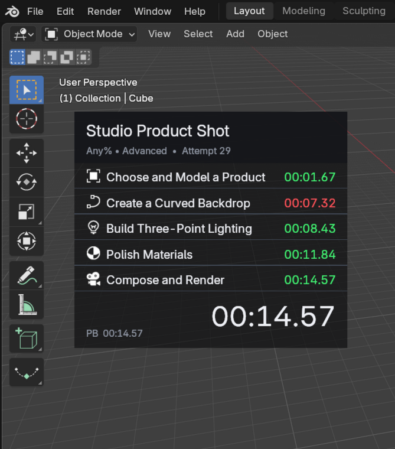
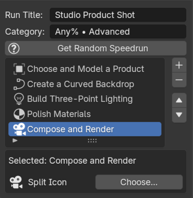
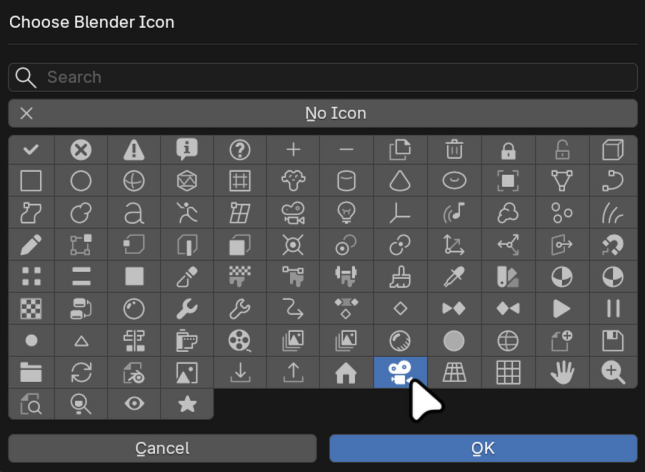
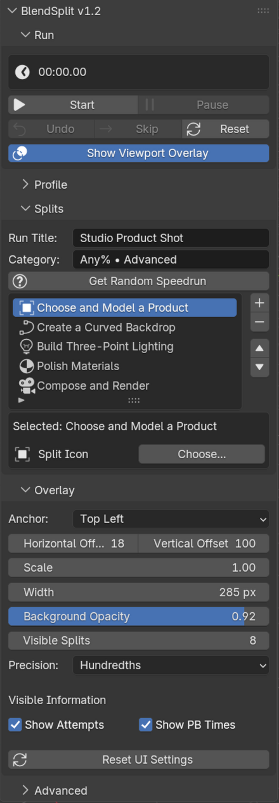

# BlendSplit

**A LiveSplit-inspired speedrun timer built directly into Blender.**

Track splits, attempts, and personal bests without leaving the 3D Viewport.
The overlay is fully customizable, and your runs are always close at hand in
the Blender sidebar.

## Make it your run

| Custom splits | Blender icons |
|---|---|
|  |  |
| Create and reorder your own splits, or generate a random Blender speedrun. | Give every split a familiar Blender icon. |

Start, pause, undo, skip, and reset from one panel. Adjust the overlay's
position, scale, width, opacity, precision, and visible information to fit your
workspace.

BlendSplit 1.3 supports Blender 5.2.

## Install

1. Download `blendsplit-*.zip` from the latest
   [GitHub Releases](https://github.com/polyfjord/BlendSplit/releases/latest).
2. In Blender, open **Edit > Preferences > Extensions**.
3. Open the menu in the top-right and choose **Install from Disk**.
4. Select the ZIP file and enable **BlendSplit**.
5. Open a 3D Viewport, press `N`, and choose the **Speedrun** tab.

Do not unzip the download before installing it.

## License

BlendSplit is free software under the
[GNU General Public License v3.0 or later](LICENSE).
